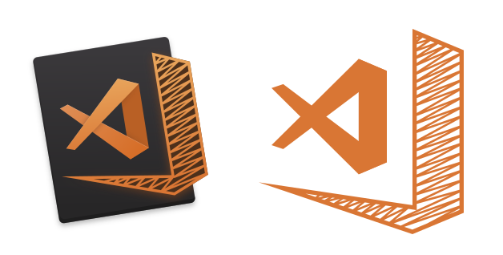

\tableofcontents

# 1 Introducion

## 1.1 Idea del projecte
La idea naix de la necessitat de comprar productes de segona mà en diferents localitats, en les actuals plataformes de compra i venda en línia, el comprador està molt perjudicat perquè ha de comprar el producte i resar perquè el venedor sigui bona persona i et enviï el producte. De  l'anterior necessitat naix la idea d'aquest projecte que es fer una aplicacio en la qual es pugui comprar i vendrà productes, nous o de segona mà directament amb el client, i fer un sistema de pagament en el qual els diners no arriben directament al venedor sense que el comprador tingui el seu producte.

## 1.2 Que pot fer el usuari ? 
Com he explicat anteriorment referits al usuari podrà comprar i vendrer productes, per tant podria fer un CRUD sobre a els seus productes, si l'usuari no està registrat, sols podrà vore el llistat de productes, i buscar-los,  el llistat serà ordenat per localitats de les mes proximes a les mes allunyades. Tampoc podrà afegirlos a la llista de favorits. L'usuari que compra podrà marcar el producte com rebut, quan li aplege el producte i estiga en perfectes condicions. Quan el producte estiga marcat com ha rebut el diners és desbloquejaran i seran enviats al venedor inmediatament. El venedor en cas que el comprador no marqui el producte com rebut podrà fer una reclamacio en la qual a els diners quedarien bloquejats fins que una administrador revisi les dues part i decidisca qui te rao

# 2 Tecnologies emprades
## 2.1 Vue
```{r, out.height= "50px", out.width = "150px", echo=FALSE, fig.align='center'}
knitr::include_graphics("./media/vue.png")
```
Vue es un framework open-source el qual es facil de gastar i de manera progresiva . Vue va ser dissenyat per un exdesarrollador de google en la intecio de millorar les carencies de angular 1.X i actualment a evolucionant adquirint lo que le pareixia mes util i simple. Pues no ha sigut un desicio facil aunque si ha sigut facil descartar angular 2 perque et obliga a gastar un llenguatge de programacio en el que no em senc molt comodo. Finalment sols quedaba React i Vue i per la forma de gestionar l'estat i la reactivitat , sense tindre que gastar llibreries externes com Redux o MobX i per aixo he escollit Vue. Empreses que gasten Vue : Xiaomi , Gitlab, Alibaba.

## 2.2 Django 
```{r,  out.height= "50px", out.width = "150px", echo=FALSE, fig.align='center'}
knitr::include_graphics("./media/django.png")
```
He decidit gastar un framework perque simplifica el treball , em fa ahorrar temps i moltes linies de codig , tambe te un gran cuantitat de funcions predeterminades per tant no tinc que estar buscant en altres llibreries. He escogit Django perque utilitza un llenguatge de alt nivell , aquest llenguatge es Python un llenguatge facil de aprendre i net en la seua estructura del projecte. Django esta dissenyat exclusivament per agilizar les tarees de la programacio web. Te un gestor de base de dades(ORM) que te evadeix de la creacio de la estructura de la base de datos , tables , columnes ... simplement has de crear el model i Django crear la tuala i les columnes en la base de datos corresponent. Empreses que gasten Django: Instagram.

### Instal~lacio kubernetes deploy localhost
#### Instalcio docker
  Instalacio del paquets per a usar un repositori sobre HTTPS
```bash
$ sudo apt-get install -y apt-transport-https ca-certificates curl software-properties-common
```
Instala la clau GPG
```bash
$ curl -fsSL https://download.docker.com/linux/ubuntu/gpg | sudo apt-key add -
```
Anadis el repositori corresponent al teu hardware en este cas anyadire el de x86_64/amd64
```bash 
$ sudo add-apt-repository "deb [arch=amd64] https://download.docker.com/linux/ubuntu $(lsb_release -cs) stable"
```
Actualiza el index
```bash 
$ sudo apt-get update
```
Instala docker (en este cas instalare la ultima versio pero Kubernetes sols esta comprobat en les seguents versions de docker: 1.11.2, 1.12.6, 1.13.1, 17.03.2)
```bash 
$ sudo apt-get install docker-ce
```

#### Instalacio minikube
Usare minikube para el deploy en localhost para comprobar que el cliente y el servidor se comunican y funciona perfectamenet , uso minikube porque es una herramienta que nos permite crear y poner en marcha un cluster Kubernetes con un solo nodo de forma casi automatica. 

Antes de instalar minikube tienes que tener instalado Docker y kubectl
Instalacion minikube:
```bash
$ curl -Lo minikube https://storage.googleapis.com/minikube/releases/latest/minikube-linux-amd64 && chmod +x minikube && sudo mv minikube /usr/local/bin/

  % Total    % Received % Xferd  Average Speed   Time    Time     Time  Current
                                 Dload  Upload   Total   Spent    Left  Speed
100 41.4M  100 41.4M    0     0  3965k      0  0:00:10  0:00:10 --:--:-- 4405k

```
Comprobar la version instalada de minikube 
```bash
$ minikube version

minikube version: v0.25.0
```

Si muestra la version es que esta instalado i esta listo para ser lanzado mediante el siguiente comando :
```bash
$ minikube start 

Starting local Kubernetes v1.9.0 cluster...
Starting VM...
Downloading Minikube ISO
 142.22 MB / 142.22 MB [============================================] 100.00% 0s
Getting VM IP address...
Moving files into cluster...
Downloading localkube binary
 162.41 MB / 162.41 MB [============================================] 100.00% 0s
 65 B / 65 B [======================================================] 100.00% 0s
Setting up certs...
Connecting to cluster...
Setting up kubeconfig...
Starting cluster components...
Kubectl is now configured to use the cluster.
Loading cached images from config file.
```

El comando anterior bajara una imagend de un maquina virtual y lanzara dentro Kubernetes como single-machine cluster. Tambien creara automaticamente los archivos necesarios para que kubectl pueda acceder y controlarlo. Una vez que este completo puedes obtener informacion sobre el cluster para verificar que esta activo y en funcionamiento: 
```bash
$ minikube status 

minikube: Running
cluster: Running
kubectl: Correctly Configured: pointing to minikube-vm at 192.168.99.100
```

Para acceder al dashboard puedes acceder mediante el navegador poniendo la ip anterior con el puerto 30000 o simplemente lazar en la terminal minikube dashboard
```bash
$ minikube dashboard
```

# Preparacion entorno virtual de python con venv
Antes de instalar Django, instalaremos una herramienta extremadamente útil que ayudará a mantener tu entorno de desarrollo ordenado en tu computadora. Es posible saltarse este paso, pero es altamente recomendable. Esta herramienta nos permitira instalar diferentes paquetes con diferentes versiones en diferentes entornos virtuales sin que entren en conflicto. Para ello lo primero que tendremos que hace es crear el entorno virtual
Si lo tenemos instalado cuando creemos el entorno virtual no nos mostrara ningun mensaje por pantalla y ademas creara las diferentes carpetas. 
```bash
$ python3 -m venv . 
$ ls
bin  include  lib  lib64  pyvenv.cfg  share
```
En caso de que no estuviese instalado , el mimso te diria como instalarlo desde tu plataforma
```bash
The virtual environment was not created successfully because ensurepip is not
available.  On Debian/Ubuntu systems, you need to install the python3-venv
package using the following command.
 
    apt-get install python3-venv
 
You may need to use sudo with that command.  After installing the python3-venv
package, recreate your virtual environment.
```
Ahora que hemos creado un entorno virtual, ejecutaremos un script para activarlo. Después de activar el entorno virtual, los paquetes que instalemos solo estarán disponibles en este entorno virtual. De esta forma, trabajaremos en un entorno aislado en el que todos los paquetes que instalemos no afectarán a nuestro entorno principal de Python ni a otros entornos virtuales.

```bash 
$ source bin/activate
(venv) $
```

Una vez que desactive un entorno virtual, volverá al entorno predeterminado de Python.
En macOS o Linux, simplemente escriba deactivate y presione Enter.
```bash
(venv) $ deactivate
$
```

# Preparacion entorno vue 
Aunque se puede desarrollar una aplicacion Vue sin Node, utilizare Node a lo largo del desarrollo del proyecto para lanzar el servidor de desarrollo , para inicializar el proyecto con vue-cli i para gestionar la dependencias. 
Para ello primero tendremos que instalar Node
```bash
$ apt-get update && apt-get upgrade -y 
$ apt-get install curl -y
$ curl -sL https://deb.nodesource.com/setup_9.x | bash -
$ apt-get install nodejs
```

Despues solo quedara inicializar el projecto con vue-cli y responder a las preguntas que nos haga como las siguientes.
```bash
$ vue init webpack whitemarket 

? Project name whitemarket
? Project description A Vue.js project
? Author oscll <oscllweb@gmail.com>
? Vue build standalone
? Install vue-router? Yes
? Use ESLint to lint your code? No
? Set up unit tests Yes
? Pick a test runner karma
? Setup e2e tests with Nightwatch? Yes
? Should we run `npm install` for you after the project has been created? (recommended) npm  
```

# Editor 
Se puede usar una  gran variedad de editores, como Visual Studio Code, Sublime Text, Atom y WebStorm. Yo recomiendo VisualStudio Code ( https://code.visualstudio.com ) ya que tiene una alta frecuencia de actualizaciones y una gran cantidad de extensiones para Vue que podemos usar para mejorar nuestro ritmo de trabajo.
```{r, out.height= "50px", out.width = "150px", echo=FALSE, fig.align='center'}

```